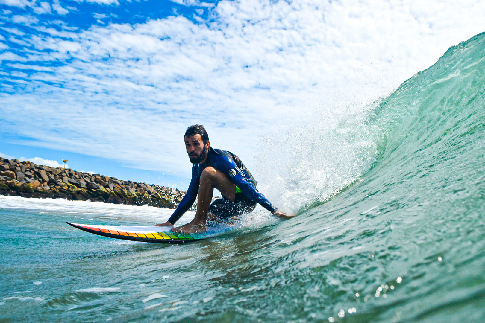

Me chamo Matheus Fernandes, sou do Ceará, comecei a Surfar em Outubro de 2019 e desde então o Surf tomou conta da minha vida.

Decidi criar esse blog para externalizar o meu processo de aprendizagem e vivência do Surf.

Surfar me traz muitas reflexões e muitas descobertas, quero compartilhar minha visão, e acho que outras pessoas que vivem isso também vão se identificar.

Além disso o processo mental do Surf é bem intenso, acho que escrever sobre essa jornada pode tornar as coisas mais claras, como uma espécie de terapia comigo mesmo.

Wheeeew 🤙

<figure>
    
</figure>