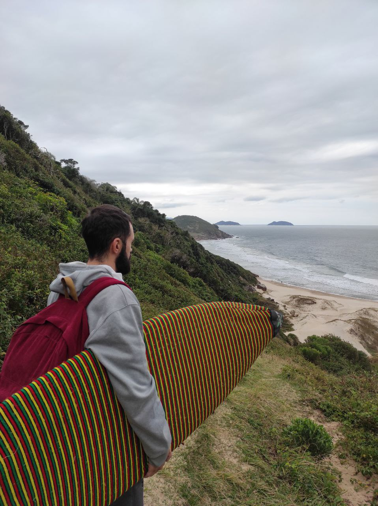
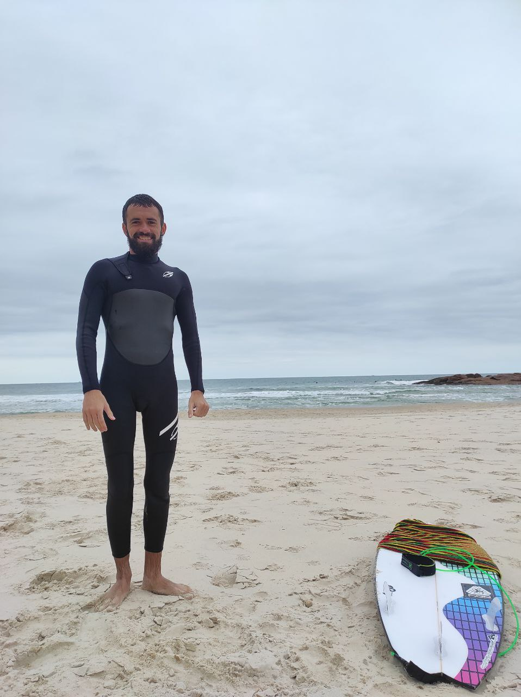

Primeiro dia de fato na guarda do embau, acostumando com o frio ainda entao teve aquele desconto pra acordar mais tarde. Queria decidir o que fazer e pra onde ir, entao pela manha fui conversar com o host o Artur, me deu algumas dicas de onde ir e alguns picos da regiao, falou que a direçao do swell, podia ta rolando onda na Prainha, que é um pico que temos que pegar uma trilha pra chegar lá.

Tomamos café da manhã , esperamos um tempo a comida descansar, e entao decidimos ir até a praia, vimos uns videos de como chegar lá e entao partimos. Fomos apé até lá, levamos uns 10 minutos para chegar ate o centrinho da cidade que é onde fica o começo da trilha, basicamente para chegar lá temos 2 trilhas, uma atravessando o morro pela mata, e outro pela costa da praia e pedras.

Decidimos ir atravessando o morro que é uma trilha mais ingrime porém mais rapida, e chegamos lá rapidinho, e tenho que dizer é uma *vista incrível*. 

<figure>
    
    <figcaption>Vista da Prainha da Guarda do Embaú</figcaption>
</figure>

Do topo da montanha conseguimos ver o pico e alguns surfistas, parecia incrivel e não via a hora de chegar lá, mas ainda faltava uma descida bem off road para a praia.

Descemos para a praia, me arrumei e entrei pelo canal que tem no canto do pico, que por sinal é um beach break. Fiquei mais em baixo do line up esperando sobrar alguma, tava dificil de me encontrar e achar essa onda.

Tentei ficar mais em baixo tambem onde tinha um outro surfista mais velho, sem muito sucesso tambem. Saí da sessão com 2 ondas só, mas era ondas que mostravam a força do pico, uma parede extensa e um drop rapido.

Mas o frio depois começou a tomar conta, tava dificil continuar na agua, e as condiçoes pareciam estar piorando também. Decidi sair logo e aceitar o surf de hoje, foi uma boa experiencia, sempre vai ter esse periodo de adaptaçao nesses picos novos, ainda mais no frio.

Para a primeira experiência tava ótimo, é preciso saber se contentar e aceitar que não conseguir surfar como surfo em casa.

<figure>
    
    <figcaption>Pós Surf na Prainha 🥶</figcaption>
</figure>

#### Aloha

> 06/08/2022 - Guarda do Embaú, SC