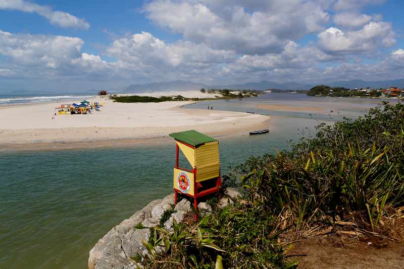

Segundo surf da viagem, primeira vez na praia da guarda, a onda que eu realmente vim atrás. E realmente era o que eu tava buscando.

Decidi ir surfar mais de tarde denovo, fui umas 11hrs. com um café reforçado, e quando cheguei lá a *condição do mar estava incrivel.*

<figure>
    
    <figcaption>Vista da Praia da Guarda, encontro do rio com o Mar</figcaption>
</figure>

Para chegar no pico tive que explorar mais um pouco, nao sabia ao certo como chegar lá, no dia anterior dei um role no centrinho da guarda e vi mais ou menos onde ficava o pico mas tinha que atravessar o rio pra chegar mais perto.

Dessa vez atravessei o rio remando com a prancha, e ao chegar do outro lado na areia, vinha voltando um surfista e perguntei se tinha alguma concorrente ou alguma dica pra me dar, é sempre bom ter esse tipo de informação quando você vai em um pico novo principalmente para sua segurança, mas ele falou que tinha uma corrente mais cedo e que agora estava tranquilo, o lance é não ter vergonha de perguntar e puxar assunto.

Ele também falou que nao precisa entrar mais no começo pelo canal pq nao tem correnteza, entao ja fiquei mais tranquilo, entrei mais perto de onde eu ja tinha parado, um pouco mais a direita de onde estava todo mundo, entrei perto de um cara que tava surfando de tow in. Foi super de boa entrar, tirando o frio, era bem raso ate perto da arrebentaçao, um pouco parecido com a Barra do Ceará que é rasinho ate la perto o pico.

Nossa o mar tava muito bom, glass total, e como era um beach break dessa vez dava pra pegar onda mais de boa, peguei uma direitinha e fui la mais pra perto do povo, fiquei por la msm que tava rolando mais umas ondinhas, depois foi a vez das esquerdas, consegui pegar umas ótimas.

E acho que não tem jeito a Baininha(minha prancha de PU que levei) é muito melhor nesses mares mesmo, acho que vou seguir mais no caminho dela na minha proxima prancha, mudando a rabeta, mas deixando o shape geral meio parecido.

Fiquei bastante tempo no mar, o frio tava bem dificil pq teve uma hora que o mar deu uma acalmada, depois que começa a dar mais umas remadas melhora, o lance é não ficar parado.

Saí novamente com a cabeça feita, as ondas estavam grandes foi um Surf mais power, novamente não consegui manobrar muito, mas o drop no critico e a parede bem extensa e alta da onda é algo que não tenho todo dia, vamos aos poucos melhorando.

#### Aloha

> 
Post Anterior: <a href="https://meusurf.blog/guarda-1">Reconhecendo o Território</a> Proximo Post: <a href="https://meusurf.blog/guarda-3">Dia do Portal</a>
