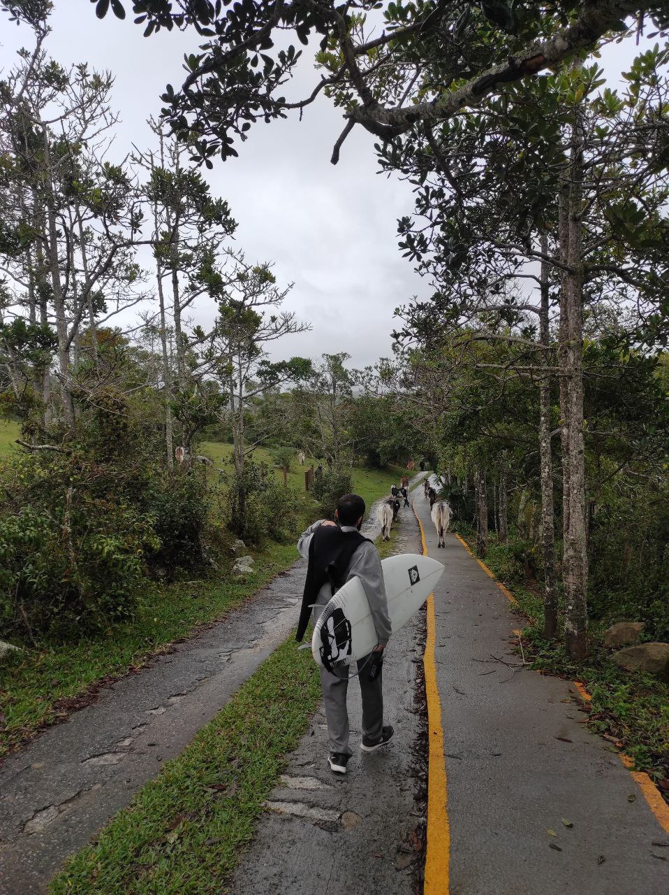
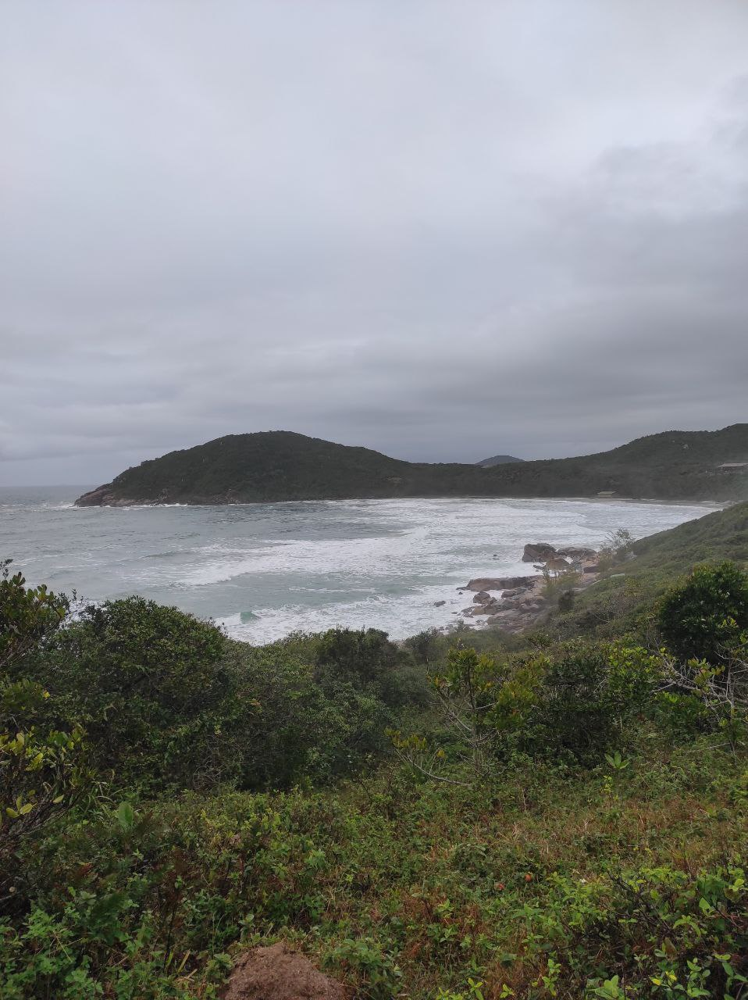
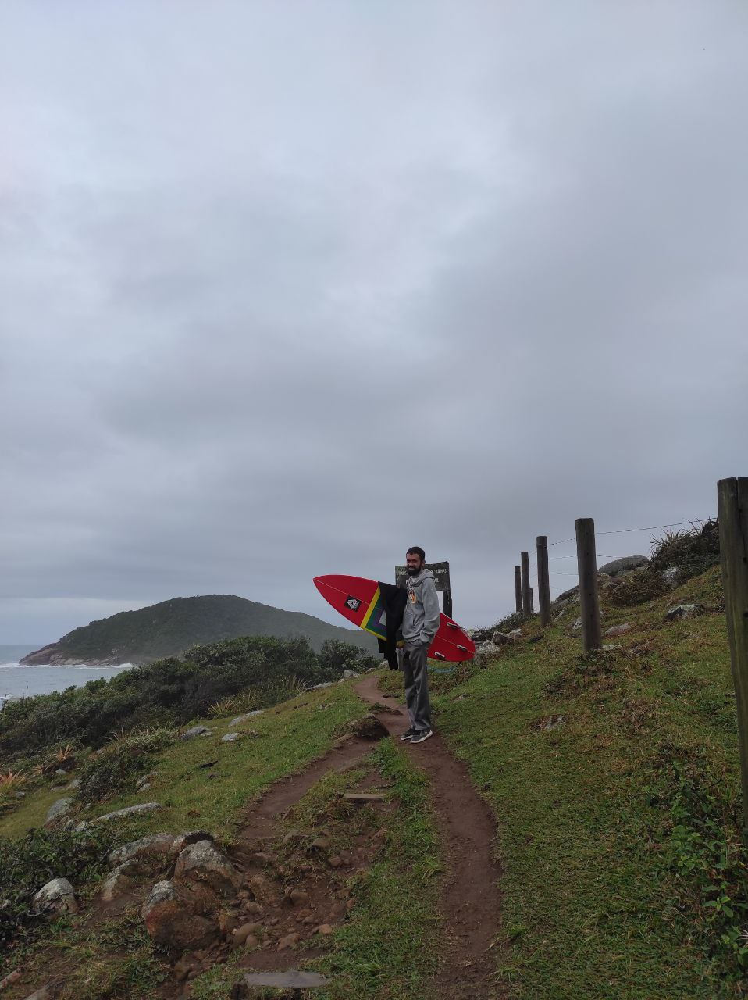

Hoje foi o dia que comecei a me aventurar mais pelo estado de SC, já que nas camêras nao vi muita gente surfando hj, e as ondas nao pareciam estar lá essas coisas. 

Decidi seguir a dica que recebi um tempo atrás do Artur e ir na Praia Vermelha, lá não tem cameras e pra chegar lá vc passa por uma propriedade privada, mas conseguiram na prefeitura abrirem o caminho da trilha pq o acesso à praia é pra ser publico.

Chegando la, vamos entrando e tem um guardinha lá que falou que somos corajosos, os primeiros a aparecer ali hoje devido as condiçoes ruims do mar. Já tava ali né vamo la ver, a trilha vai passando do lado de uma fazenda, e o caminho cheio de vacas e côcô, vamos indo mei devagar respeitando as vacas né pq tinham umas com uns chifres gigantes.

<figure>
    
    <figcaption>Vaquinhas no caminho para a Praia Vermelha</figcaption>
</figure>

Após uns 5 minutinhos chegamos num ponto que dava pra ver a praia e as ondas, nao pareceu muito promissor, fiquei um tempo ali e decidi voltar e ir para a Praia do Rosa, onde vi que tinham mais ondas e gente surfando pelas cameras.

<figure>
    
    <figcaption>Vista para a Praia Vermelha</figcaption>
</figure>

Na volta da trilha vem vindo 3 surfistas, me perguntaram como tava lá as ondas, disse que nao tinha muita coisa, sempre fico com medo de dar esses relatorios, por que vai que digo que o mar tá ruim e na visão deles tiver bom. Continuei voltando pro carro rapido, vai que eles voltam né kkk e então segui para a praia do rosa.

Chegando no Rosa o mar parecia estar bem melhor, e tinham mais pessoas surfando, chegamos por volta de umas 16hrs, logo me arrumei botei a roupa de borracha, tava um frio foda. desci pra praia me alonguei e entrei no mar. Observei as pessoas entrando e vi que tinha um canal no canto direito perto das pedras, fui por la e foi tranquilo entrar, tirando é claro o FRIO.

Tava um mar dificil, dificil de achar as ondas. todo mundo tava comentando sobre e que tava complicado pegar as ondas. Ah, logo depois que entrei os 3 caras que tavam na trilha mais cedo tinham chegado, realmente ali era o melhor lugar pela região.

Consegui pegar umas 2 ondinhas boas ainda, o drop é bem tranquilo, a onda mais gorda e com uma paredona. Na ultima onda consegui fazer a cavada pra batida de frontside mas os pés já estavam muito dormentes, nao conseguia sentir muito bem, mas não completei a manobra pq achei que a seçao era muito crítica, mas logo após vi que nao era nada de mais, se tivesse tentando e flexionado o tronco com mais intensidade e intenção dava certo. Fica de liçao pra próxima.

Não tem foto da Praia do Rosa porque estava chovendo bastante na hora e não deu pra pegar o celular pra bater as fotos, nem achei nenhum fotográfo.

Mas o auge do dia foi o que apareceu no mar hoje, bem proximo a mim apareceu uma Baleia, no começo fiquei na duvida, mas logo depois mostrou a nadadeira e fiquei pasmo, foi um sensaçao muito massa, ver assim de perto. Isso fez o dia e me fez olhar mais ao redor e ve onde eu tava, as montanhas o verde e toda essa situçao que não tenho normalmente, é sobre isso, tem que ser.

Só agradecer mesmo.

<figure>
    
    <figcaption>Trilha da Praia Vermelha</figcaption>
</figure>

#### Aloha

> 08/08/2022 - Guarda do Embaú, SC