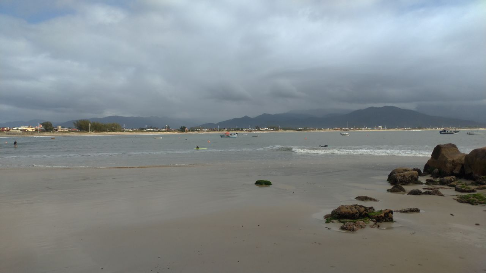
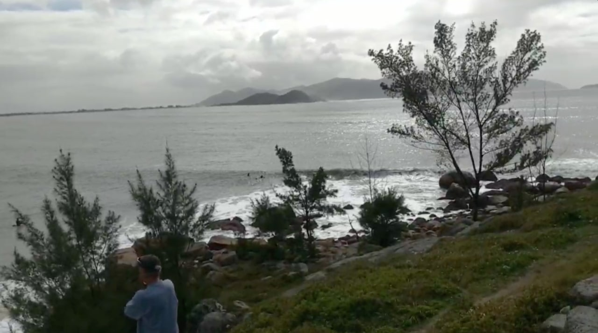
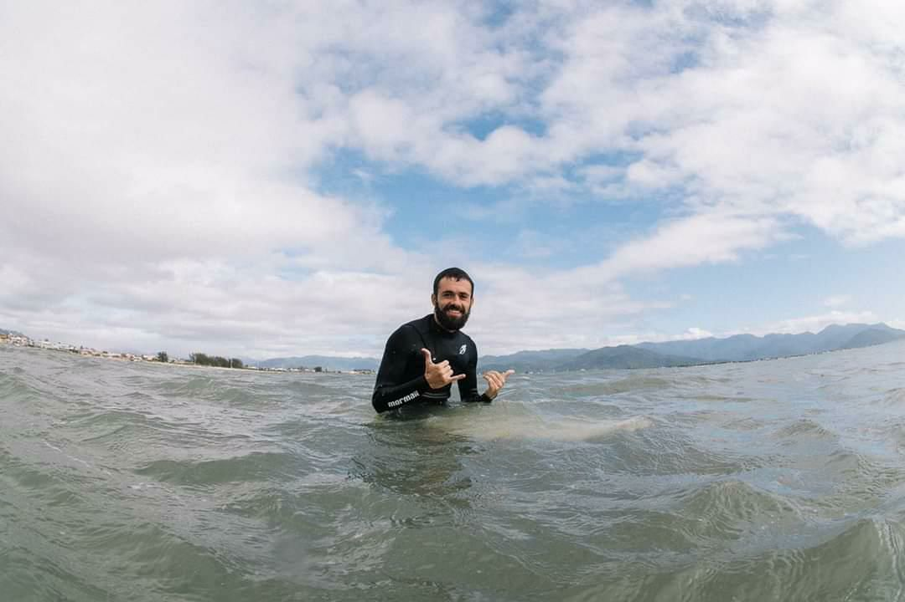

Segundo dia do swell, depois de tirar um dia pra descanso forçado devido as condições do mar, hoje o vento deu uma melhorada e o mar ainda tem força. O dia tava parecendo que ia ser bom.

Logo pela manhã, depois do café recebo um wpp da host do AP que o Artur estava indo surfar no Costão da pinheira e que ja tava indo, e pediu pra avisar que a melhor condição seria agora. 

Parei tudo que tava fazendo e arrumei minhas coisas pra ir surfar, mas ainda nao tinha certeza onde era exatamente o pico, tinha tentado ir ver a praia da pinheira ontem e me perdi e não consegui achar o pico certo.

Botei um lugar diferente no google , mas nao parecia mto certo. Mas durante o caminho vi um carro com uma prancha dentro, e decidi seguir ele. Decisão correta pois ele me levou ate o estacionamento que fica em frente o pico, onde vi o carro do Artur e ja confirmou que era ali.

<figure>
    
    <figcaption>Praia da Pinheira</figcaption>
</figure>

Hoje o dia amanheceu com um Sol de leve, diferente dos ultimos dias nublados e chuvosos. Ponho minha roupa e vou indo entrar, perguntei pra outro cara que tava entrando como funcionava ali, disse que tinha um caminho pelas pedras que termina mais ja do lado do pico o que precisa de menos remada.

Vou por esse caminho e ja saio mais perto do pico, um visual incrível cheio de montanhas e muita mata bem verde, o mar parecia mais calmo, mas é por que ainda nao estava no pico. Tentei ficar mais pra baixo onde tinha uns SUP e longs, o Artur também tava lá e falou que ali era mais pra pranchão mesmo e disse pra subir mais que lá era o pico das pranchinhas.

Chego lá depois de dar a volta no costão e o pico tava frenetico, parecia meio lento no começo mas as series começavam a vir cada vez maiores e com muita força. Nesse Inicio fiquei mais como espectador vendo como os locais surfavam, e a realidade é outra, surfar esses tipos de ondas, tubulares e com mais pressão não é tarefa simples. 

<figure>
    
    <figcaption>Costão da Pinheira</figcaption>
</figure>

Foi aí meio que percebi como a gente é levado a acreditar que aquilo é algo simples e sem muitas consequencias quando a gente fica vendo algum video de surf no Youtube por exemplo. A realidade é outra, nesse pico por exemplo as ondas quebravam praticamente em cima das pedras do Costão, e um erro podia ser perigoso. Foi cada caldo doidera que eu vi de perto, a onda jogava os surfistas sem nem perceber. Isso você não pensa na hora que ta vendo um video de surf com uma trilha sonora por cima, pq o barulho da propria onda quebrando já é bem impactante.

Tinha uma correnteza chata também entao foi preciso muita remada pra ficar no pico, e isso é outro ponto: não sou acostumado com Point Break, eu tenho um problema pra pegar onda em meio ao crowd e conseguir me posicionar hoje foi uma luta.

Depois de muitas tentativas, finalmente consegui, sobrou a MINHA onda. Tava um pouco mais em baixo do pico e essa onda passou , remei em direçao ao pico pra conseguir entrar na onda, consegui fazer o drop e o resto foi só alegria. A onda é estilo Snaper Rock, uma onda bem extensa, mas mais lenta aqui o que deu tempo de ajeitar a base, pensar em ler a onda, aproveitar o momento, fui seguindo no fluxo na onda sem sentar muita coisa, mas ainda consegui fazer um cutback.

Consegui flexionar meu tronco, e olhar para a onda quebrando, me mantendo no pocket, dava uma investida e voltava pro inicio da onda, continuei assim por algumas dezenas de metros. Posso dizer que essa foi a onda mais extensa que surfei. Valeu o dia

<figure>
    
    <figcaption>Surf no Costão da Pinheira</figcaption>
</figure>

Mas depois disso nao consegui mais encaixar outra onda dessa, e foi ai que a minha mente começou a pensar loucamente, tive problemas pra só aproveitar o momento e esqueceR as ondas do futuro, queria focar apenas ali no agora e em toda a vibe do lugar novamente, processos que vao aos poucos.
#### Aloha

> ⟵ <a href="https://meusurf.blog/guarda-4">Trip Guarda #4 - Rosa</a>  
> ⟶ <a href="https://meusurf.blog/guarda-6">Trip Guarda #6 - O que tava Guardado</a>