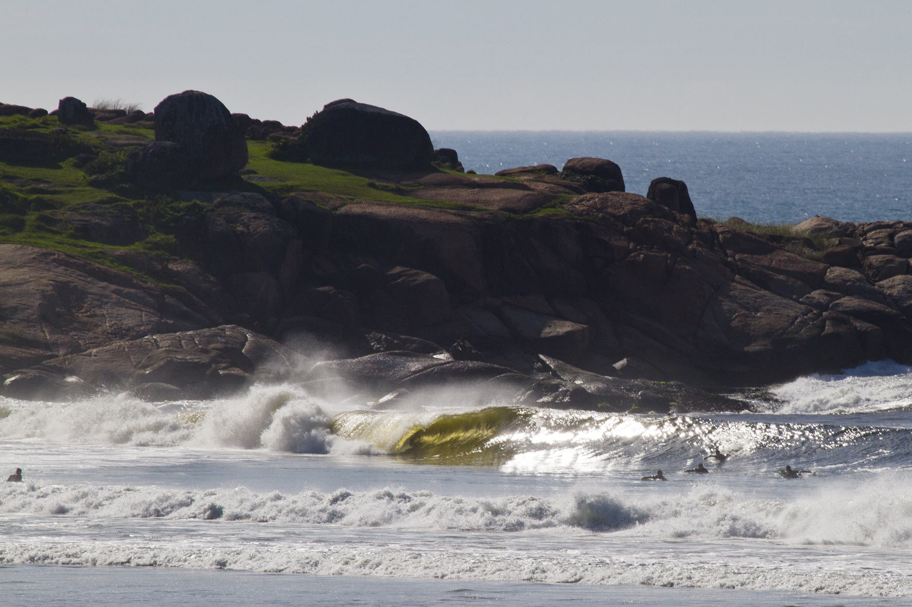
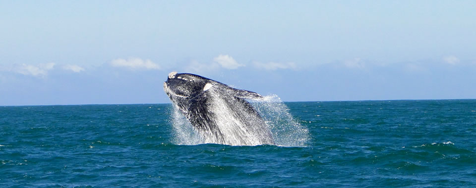

Ultimo dia na guarda, decidi acordar cedo para ir surfar, a ideia era evitar o crowd. A previsão era o mar da uma diminuída, fui olhar as cameras então, mas não parecia ter diminuído tanto.

Não pensei muito e fui logo comer algo leve, comi umas bananas e tomei bastante agua, vesti a roupa de borracha passei parafina e estava pronto pro surf. Dessa vez aprendi e fui de chinela pro surf pra evitar o chão gelado e conseguir ir/voltar mais rápido também.

Parti então para a Praia da Guarda, ia tentar fazer do mesmo jeito que fiz a primeira vez atravessando o rio, mas quando cheguei na beira do rio vi as ondas de longe e pareciam grandes e pesadas, deu uma vontadezinha de desistir mas decidir tentar surfar ainda. Mas vi algumas pessoas entrando mais a frente, por outra parte de terra que fica mais proximo ao costão.

Decidi dar a volta e seguir pela trilha do costão, pois ja tinha feito a trilha e sabia que dava pra descer para aquela parte da praia, e já adianto foi a decisão correta. Seguindo pela trilha cheguei nessa outra parte da praia que fica bem mais proximo do pico e do canal que tem ao lado do costão. Consegui entrar pelo canal muito facilmente, só tive que esperar a série passar(sempre muito importante analisar isso antes de começar a remar) e foi sucesso.

Posso dizer sem medo que esse foi o melhor mar que já vi de perto, ondas  grandes, alinhadas e com muita força. O mar também estava mais marrom, pelo que vi a agua dessa cor é mais comum nessa época do ano principalmente com swell de leste.

<figure>
    
    <figcaption>Ondas no Costão da Guarda(foto ilustrativa, mas tava maior que isso, mas nao tão perfeito)</figcaption>
</figure>

Como todos os outros surfs dessa viagem, tive dificuldades para me achar no mar. O fator medo estava começando a me afetar de novo, passei um tempinho analisando os outros surfistas. Tentei pegar algumas ondas mas estava com medo de remar na parte mais critica da onda e logo entendi, e na real sempre soube que se quiser pegar onda em um mar desse tipo é necessário remar na parte critica, caso contrario a onda não vai ter força pra me levar.

Decidi descer um pouco mais e tentar pegar uma onda mais baixo. A estratégia deu certo, engoli o medo e decidi que ia pegar uma onda. Esperei a onda certa vir , aquela que já vem com o seu nome, remei pro critico da onda sem pensar em mais nada, era uma esquerda. Consegui entrar na onda, consegui fazer o drop na parede já, ajustei minha base e pronto, estava surfando aquela onda. Foi uma sensação muito boa, pois realmente consegui ter o controle da prancha.

Segui acelerando na onda e seguido o fluxo. Não consegui fazer manobras pois não consegui me encaixar em nenhuma sessão , e na que eu escolhi não tive coragem de realizar a manobra pois na hora julguei que era uma junção muito critica. Naquele momento não importou muito pq o fato de ter conseguido pegar a onda em si já foi o bastante.

E o melhor de tudo, agora estava com a confiança lá em cima, e sabia que era possível pegar mais ondas. Continuei com a mesma abordagem e funcionou novamente, e dessa vez peguei uma direita. Remando no critico da onda de novo, dessa vez a onda era um pouco mais cavada, mas o drop fluiu perfeitamente.

Sabe aquele drop que tudo encaixa perfeitamente, a borda da prancha encaixou perfeito na parede da onda, consegui descer mais a onda e dar uma primeira acelerada, a parede da onda ia se formando na minha frente, enorme, maior do que eu. Conseguir coordenar os braços com o movimento do corpo o que facilitou essa aceleração

Mas então comecei a perceber que eu estava começando a correr mais que a onda. Isso é algo que tenho tentado focar bastante, de começar a perceber mais o ritmo da onda.

Tentei então dar uma desacelerada, mas meio que sem querer já fui emendando com uma cavada na base da onda, o que me levaria a batida no lip da onda. Dei sequência a manobra, mas não consegui realizar pois acho que acabei em uma sessão da onda muito deitada, e minha manobra foi muito curta, deveria ter alongado mais.

Mas olhando agora, acho que essa não era a manobra que a onda pedia,  devia ter tentado voltar mais ao inicio da onda, com um cutback para então continuar e achar outra sessão mais adequada. Aprendizados.

Nessa manobra incompleta, acabei levando o caldo junto com o Lip, e a onda me jogou então com prancha e tudo com muita força para baixo. Foi o maior caldo da viagem, tive sorte de não bater na prancha. Mas ainda encostei no fundo de areia, mas tentei manter a calma pois o caldo geralmente não é tao longo. Deu tudo certo.

Após essa onda, tive que voltar para a areia perto da boca do rio, e então caminhar de novo até o canal onde entrei, vi que as pessoas estavam fazendo isso, pois a remada de volta ao pico podia ser bem cansativa ou impossível.

Mas esse segundo round não foi muito bom, não consegui pegar ondas e basicamente fiquei tentando remar em algumas ondas, enquanto tentava escapar das séries que vinham ao fundo. Depois de muita batalha mental sobre desistir vs tentar pegar a saideira, decido que vou tentar sair logo mesmo.

Mas pra minha surpresa vi um acontecimento que me marcou mais ainda, o aparecimento de outra Baleia. Mas dessa vez ela não simplesmente acenou, ela estava dando pulos na agua, foi mágico ver ela  saltando e depois toda aquela agua que jorrava devido a seu tamanho enorme. Sem palavras pra descrever. Eu fui eu tava.

<figure>
    
    <figcaption>Baleia Franca dando um pulinho</figcaption>
</figure>

Aceitei isso como um sinal e decidi sair remando mesmo, por que o frio já tinha tomado conta do meu corpo também e minha cabeça já estava mais do que feita.

Blessed.

#### Aloha

> 13/08/2022 - Guarda do Embaú, SC