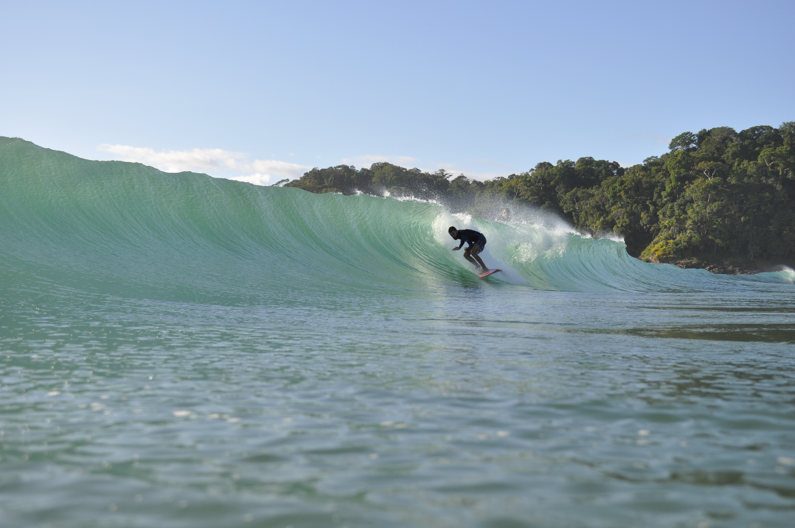

import { OutboundLink } from "gatsby-plugin-google-gtag"

Chegou a hora da próxima trip: Itacaré. Um destino já conhecido, fui para lá na mesma época no ano passado, e parando para analisar, acho que foi ali que passei a focar mais no meu processo de evolução do Surf. Não que não estivesse focado antes, mas foi ali que percebi o tamanho do gap que existia.

<figure>
    
    <figcaption>Tubo Praia da Tiririca</figcaption>
</figure>

Contextualizando a viagem que fiz ano passado, eu fui para essa viagem sozinho e sem saber muitas coisas: me deu vontade de ir e fui. Soube desse destino através da <OutboundLink href="https://www.instagram.com/itimsilvasurfschool/">Itim Silva Surfschool</OutboundLink> que tinha realizado uma trip pra lá um pouco antes de eu começar a surfar. Então, já tinha me ligado que esse era um lugar bom para ir.

Além de tudo tenho uma relação especial com a Bahia e sua cultura, principalmente por causa do <OutboundLink href="https://www.youtube.com/watch?v=ne7E5geBMWE">BaianaSystem</OutboundLink>. Sou muito fã dessa banda e de tudo que ela representa. Se você ainda não conhece, deveria. Vou deixar essa playlist aqui do Spotify sobre eles, mas não tem erro: só ir no Spotify e dar play nas mais tocadas. Ainda quero fazer uma playlist para o surf, várias no caso. No futuro quem sabe eu faça.

<figure>
    
    <figcaption>BaianaSystem é só amor</figcaption>
</figure>

Enfim, voltando para Itacaré.  Para quem não conhece vou explicar brevemente como é o trajeto até lá, o que não é tão rápido. Itacaré fica no sul da Bahia e o meio mais rápido de chegar até lá partindo de Salvador é pegando a Balsa no terminal marítimo São Joaquim, dá mais ou menos uma hora esse percurso.

Ao chegar do outro lado, desembarcamos em Bom Despacho, Itaparica. Aqui peguei um ônibus, mais um percurso de 5 horas mais ou menos até o nosso destino. Tudo isso aprendi através do google, não tinha muita noção além disso, mas deu tudo certo e consegui chegar tranquilamente, porém, cansado.

Fiquei em um airbnb próximo a Praia da Tiririca, uns 5 minutinhos do pico, um lugar muito legal, inclusive o dono de lá já morou na Taíba, bastante tempo. E, deu umas dicas sobre os picos dali, mas eu também já tinha pesquisado sobre as praias e ondas da região. 

Tenho muito sobre o que falar dessa minha primeira viagem, mas o foco aqui é sobre o que aprendi naquela viagem e o que tenho de expectativa agora depois de 1 ano e muito treino. Então, vou focar nisso agora, mas está planejado esse diário de bordo da minha primeira viagem, algum dia postarei aqui.

<h1 align="center">
  1º Aprendizado: Meu preparo físico não estava bom o suficiente.
</h1>

Até aquele momento o surf era minha única atividade física, e era o suficiente para as ondas que eu estava surfando. Mas, para chegar no nível de surf que eu almejo e o tipo de ondas que eu quero surfar, isso não é o bastante.

#### Aloha

> ⟵ <a href="https://meusurf.blog/guarda-6">Trip Guarda #6 - O que tava guardado</a>