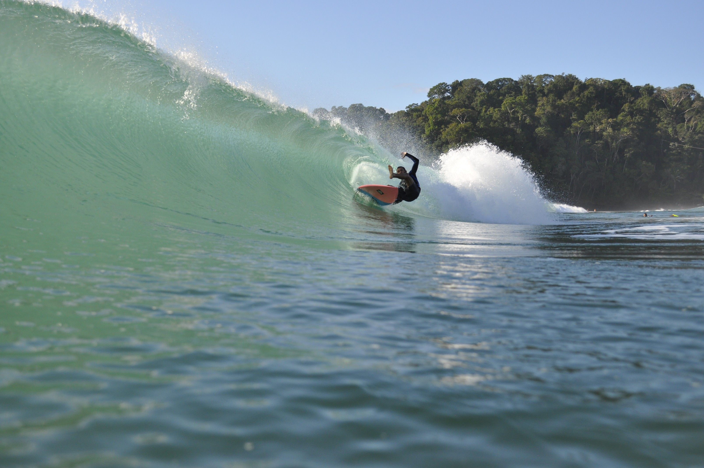
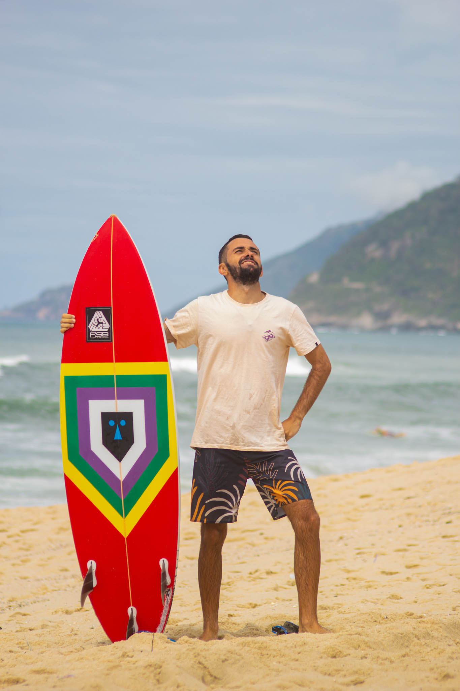
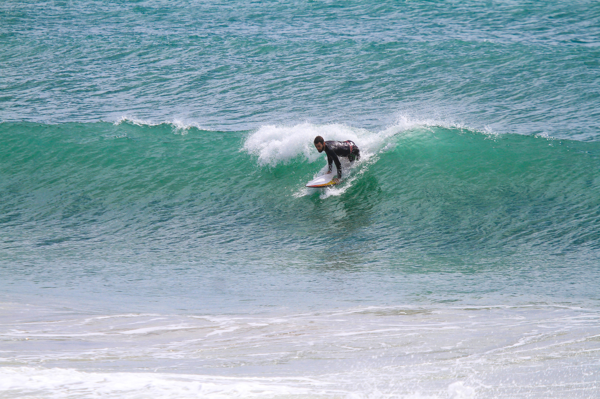
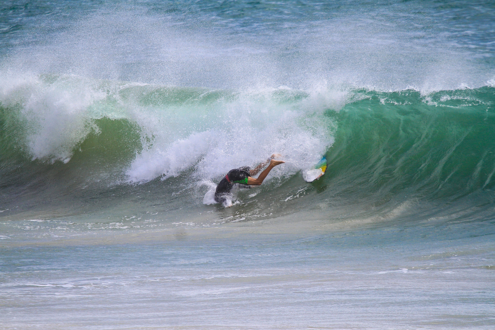

import { OutboundLink } from "gatsby-plugin-google-gtag"

Chegou a hora da próxima trip: Itacaré. Um destino já conhecido, fui para lá na mesma época no ano passado, e parando para analisar, acho que foi ali que passei a focar mais no meu processo de evolução do Surf. Não que não estivesse focado antes, mas foi ali que percebi o tamanho do gap que existia.

<figure>
    
    <figcaption>Tubo Praia da Tiririca</figcaption>
</figure>

Contextualizando a viagem que fiz ano passado, eu fui para essa viagem sozinho e sem saber muitas coisas: me deu vontade de ir e fui. Soube desse destino através da <OutboundLink href="https://www.instagram.com/itimsilvasurfschool/">Itim Silva Surfschool</OutboundLink> que tinha realizado uma trip pra lá um pouco antes de eu começar a surfar. Então, já tinha me ligado que esse era um lugar bom para ir.

Além de tudo tenho uma relação especial com a Bahia e sua cultura, principalmente por causa do <OutboundLink href="https://www.youtube.com/watch?v=ne7E5geBMWE">BaianaSystem</OutboundLink>. Sou muito fã dessa banda e de tudo que ela representa. Se você ainda não conhece, deveria. Vou deixar essa playlist aqui do Spotify sobre eles, mas não tem erro: só ir no Spotify e dar play nas mais tocadas. Ainda quero fazer uma playlist para o surf, várias no caso. No futuro quem sabe eu faça.

<figure>
    
    <figcaption>BaianaSystem é só amor</figcaption>
</figure>

Enfim, voltando para Itacaré.  Para quem não conhece vou explicar brevemente como é o trajeto até lá, o que não é tão rápido. Itacaré fica no sul da Bahia e o meio mais rápido de chegar até lá partindo de Salvador é pegando a Balsa no terminal marítimo São Joaquim, dá mais ou menos uma hora esse percurso.

Ao chegar do outro lado, desembarcamos em Bom Despacho, Itaparica. Aqui peguei um ônibus, mais um percurso de 5 horas mais ou menos até o nosso destino. Tudo isso aprendi através do google, não tinha muita noção além disso, mas deu tudo certo e consegui chegar tranquilamente, porém, cansado.

Fiquei em um airbnb próximo a Praia da Tiririca, uns 5 minutinhos do pico, um lugar muito legal, inclusive o dono de lá já morou na Taíba, bastante tempo. E, deu umas dicas sobre os picos dali, mas eu também já tinha pesquisado sobre as praias e ondas da região. 

Tenho muito sobre o que falar dessa minha primeira viagem, mas o foco aqui é sobre o que aprendi naquela viagem e o que tenho de expectativa agora depois de 1 ano e muito treino. Então, vou focar nisso agora, mas está planejado esse diário de bordo da minha primeira viagem, algum dia postarei aqui.

<h3 align="center">
  1º Aprendizado: Meu preparo físico não estava bom o suficiente.
</h3>

Até aquele momento o surf era minha única atividade física, e era o suficiente para as ondas que eu estava surfando. Mas, para chegar no nível de surf que eu almejo e o tipo de ondas que eu quero surfar, isso não é o bastante.

Logo após a viagem comecei a treinar, tenho muita preguiça de ir até a academia, mas tive a sorte de achar um personal trainer que mora no meu prédio e consigo malhar na própria academia do prédio também. Não tem tantos equipamentos, mas o Serginho (personal) consegue montar treinos com o que a gente tem, e o resultado veio. Minha remada e resistência aumentaram bastante.

<h3 align="center">
  2º Aprendizado: Tipo de prancha errado
</h3>

<figure>
    
    <figcaption>Vaca na onda da tiririca</figcaption>
</figure>

Na verdade esse é um ponto que ainda não tenho tanto conhecimento sobre qual o melhor tipo de prancha pra cada tipo de onda. Basicamente, preciso entender melhor como as pranchas funcionam, sobre como o rocker influencia, tamanho e formato da quilha.

Mas enquanto surfava na Tiririca estava com fotógrafo na água, e ele deu a dica de que a minha prancha não era tão indicada para ondas mais tubulares: ela tinha uma borda maior, a rabeta squash e a área do bico muito pequena. Levei essas informações pro meu shaper da Flora logo após a viagem.

Fiz uma nova prancha, a Baianinha, que pretendo testar aqui agora de novo. Mas já usei ela no Rio, Ubatuba e Guarda do Embaú, e realmente foi a melhor escolha: ela se encaixou muito bem e basicamente só consegui surfar com ela nesses picos.

<figure>
    
    <figcaption>Prancha: Baianinha</figcaption>
</figure>

Fico devendo entender mais sobre pranchas , quilhas e todo o resto sobre o meu equipamento. Mas, creio que isso vai vindo com os anos, e com o teste de mais pranchas diferentes. Ainda quero ter uma biquilha, acho que vai ser minha próxima prancha.

<h3 align="center">
  3º Aprendizado: Remar sem medo, ter a intenção e não hesitar
</h3>

<figure>
    
    <figcaption>Drop no Portão</figcaption>
</figure>

Outro conselho que veio do fotógrafo, mas é uma coisa que já sabemos, porém, quando alguém lhe fala na hora parece que faz mais sentido. Esse conselho se aplica principalmente a ondas cavadas e tubulares, pois nesse tipo de onda ter 1 milésimo de dúvida vai te fazer perder o timing da onda, o que é pior do que você remar sem hesitação, o caldo é muito mais de boa se você for com tudo.

É uma batalha mental com você	 mesmo, eu aprendi que você não pode pensar muito nessas horas: a partir do momento que você escolheu a onda e começou a remar você vai descer essa onda, seja dropando e surfando ela, ou caindo e levando um caldo. Decidiu tá decidido.

Após essa viagem coloquei como meta também levar mais caldos, é uma habilidade importante de se ter. Saber levar caldo vai ser importante no processo de surfar ondas maiores pois, o processo de aprender a surfar ondas maiores vai ser composto de muitos caldos e, estar confortável nessa situação vai ajudar nesse processo.

<figure>
    
    <figcaption>Caldo no Portão</figcaption>
</figure>

Depois desses aprendizados e de 1 ano trabalhando em cima deles, venho novamente a Itacaré	e é hora de ver a diferença	que isso fez.

Vamos lá, aguardem os próximos episódios

#### Aloha

> ⟵ <a href="https://meusurf.blog/guarda-6">Trip Guarda #6 - O que tava guardado</a>