import { OutboundLink } from "gatsby-plugin-google-gtag"

Começamos o segundo dia cedinho, saímos 5 da manhã em direção ao Abacateiro, um pico que eu acho muito massa e tem uma das melhores direitas do nordeste (acho). Uma onda muito fácil de Surfar e que lhe dá tempo para treinar o que você quiser.

<figure>
    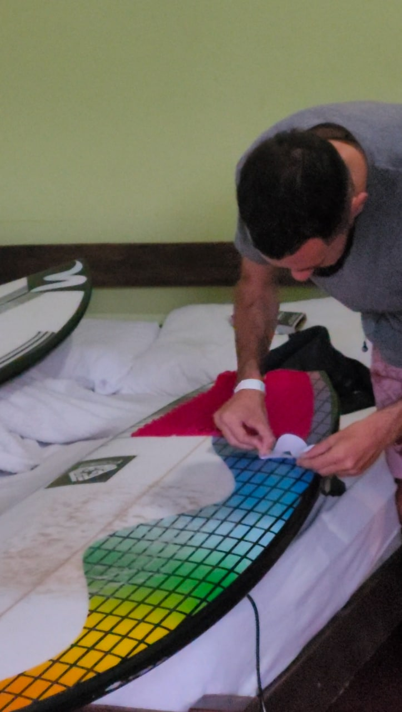
    <figcaption>Colocando Adesivo da <OutboundLink href="https://www.instagram.com/novatimstorm/" target="_blank">@novatimstorm</OutboundLink></figcaption>
</figure>

<figure>
    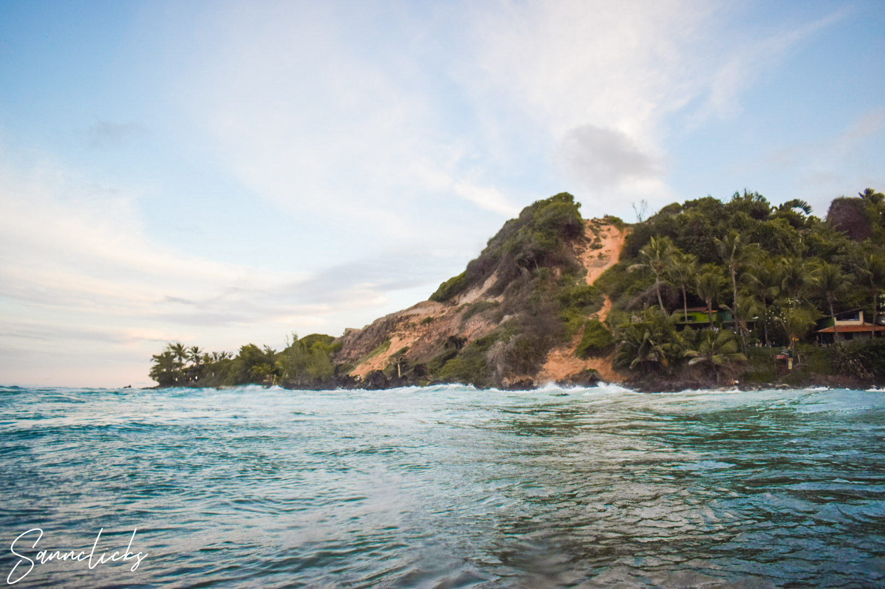
    <figcaption>Praia do Abacateiro <OutboundLink href="https://www.instagram.com/sannclicks/" target="_blank">@sannclicks</figcaption>
</figure>

Chegamos cedinho, tinham poucos surfistas na água, não perdemos tempo e entramos logo. Antes tinha mais dificuldade para entrar/sair desse pico, porque na maré seca tem alguns corais no caminho, mas dessa vez foi bem tranquilo.

<figure>
    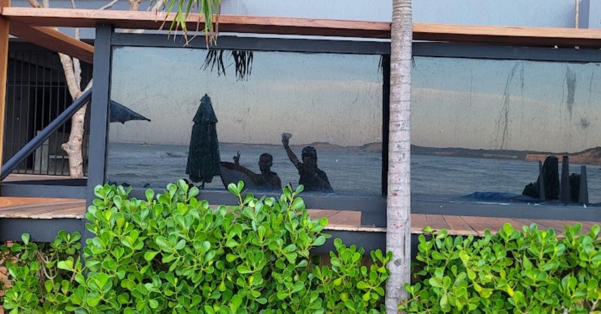
</figure>

O Abacateiro é uma espécie de point break, não é inteiramente um point break porque ainda sobra umas ondas mais embaixo do pico principal. Novamente tive dificuldades com esses tipos de pico, tenho uma dificuldade para me encaixar e conseguir pegar boas ondas. Conforme o crowd foi aumentando, cada vez mais longe do pico eu ficava.

Mesmo assim, consegui pegar algumas boas ondas e consegui dar mais uma afiada no front side, o meu lado de surf mais fraco. Consegui dar umas rasgadinhas e acelerar na onda para passar algumas sessões, mas o problema de não se agachar e flexionar os joelhos persiste, no mais foi um bom surf, o visual tava incrível com aquela iluminação do começo da manhã.

<figure>
    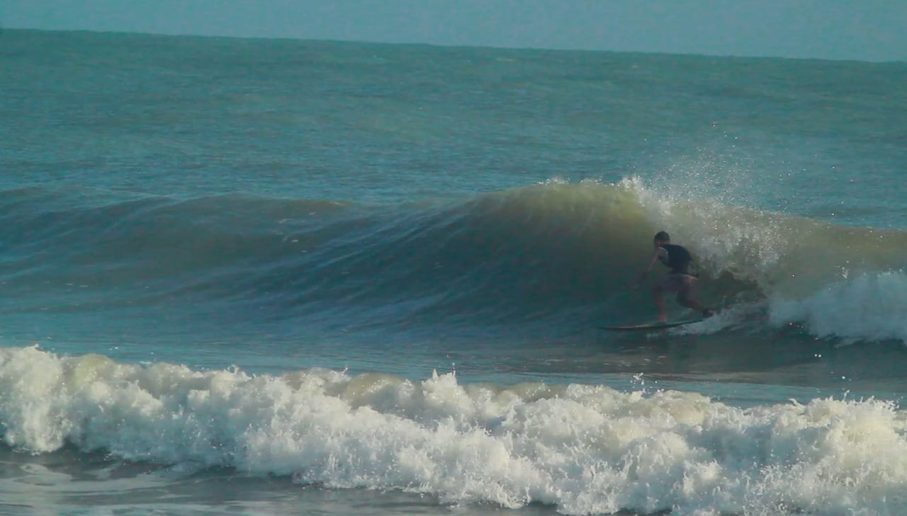
</figure>

<figure>
    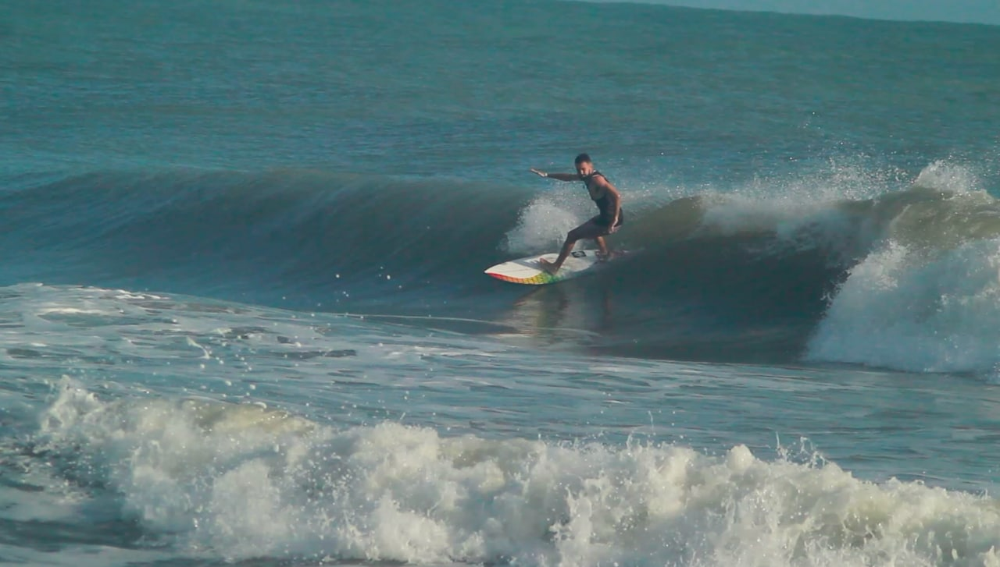
</figure>

Voltamos para o Arara umas 6:30h (acho), fomos tomar banho e se preparar para o café da manhã. E que café! Nossa, comi muito e bateu aquele cansaço com sono pós surf. Voltei pro quarto, dei aquele cochilo rápido, o suficiente para não entrar em sono profundo e acordar sem saber que ano é e mais cansado ainda, mas o necessário pra dar uma descansada.

<figure>
    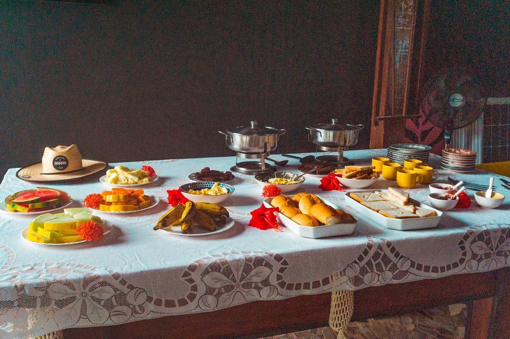
    <figcaption>Café top do Surf Camp Arara</figcaption>
</figure>

Itim falou que o próximo pico que íamos surfar era a Lajinha. Nunca surfei esse pico mas tive uma oportunidade no passado, na minha primeira viagem pra Pipa. Mas na época decidi não ir, deixei o medo que a galera botou sobre as pedras e de lá ser muito raso ganhar de mim. Julguei não ter nível de surf o bastante naquela época, pois era uma onda mais pesada e tubular quando realmente está bom. Hoje acho que teria conseguido surfar naquela época, teria sido bom para minha evolução e me acostumar a entrar e sair do mar pelos corais e através de bancadas.

Enfim, partimos para a Lajinha, estava bem motivado e animado para ir lá e provar para mim mesmo que evoluí e posso ter confiança de surfar aquela onda, gosto de me superar nesses momentos e parece que tenho mais energia, vontade e certeza de que conseguirei, não tem outra opção.

Pra quem não conhece a Lajinha fica no canto direito da Praia do Amor, pra entrar lá você caminha até o fim da praia e vai pela areia/corais até mais próximo do mar, o caminho é cheio de pedras e você precisa andar na manha, de leve. Depois de chegar na beira do coral você pula para o mar , mas ainda tem uma bancada mais a frente, essa é a pior hora porque é difícil de passar pelas ondas que quebram na frente do coral.

<figure>
    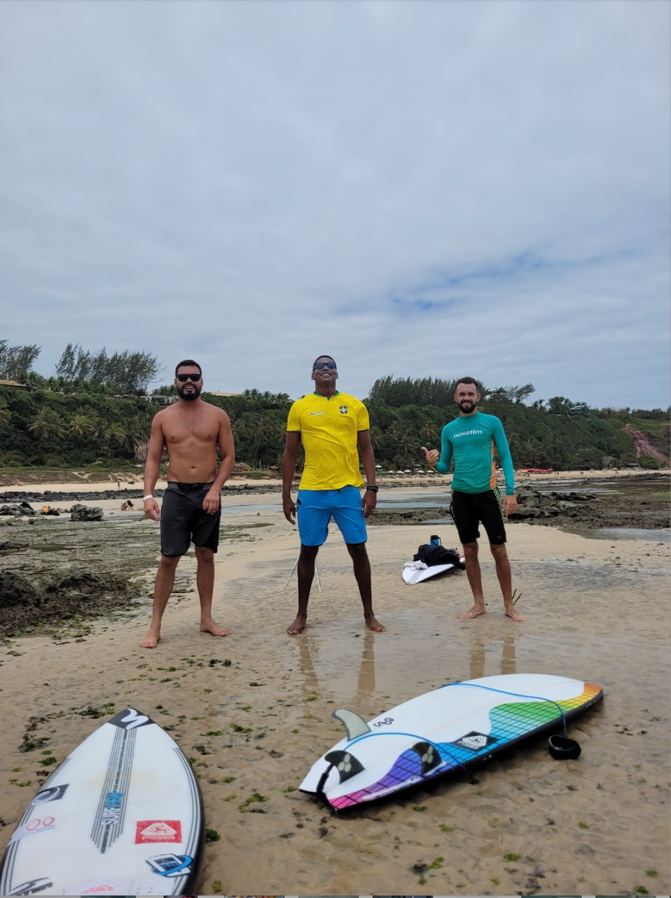
    <figcaption>Preparando pra entrar na Lajinha, e eu de cosplay de novateacher</figcaption>
</figure>

Não estava muito tranquilo e na hora foi um pouco tenso conseguir passar essa arrebentação, quando você fica nervoso tudo fica mais difícil e você não consegue raciocinar muito bem. Mas, o maior medo era de perder as quilhas, principalmente porque não eram minhas e sim emprestadas do Itim, fizemos uma troca de quilha no começo da viagem. Teve alguns breves momentos de desespero quando o nível da água estava naquele meio termo: onde você não sabe se tenta pular a onda ou tenta dar uma furada mais rasa, tentei dar umas 2 furadas mas ainda encostei o bico da prancha numa pedra de leve. Mas deu tudo certo, pelo menos pra mim, porque um pivete que entrou um pouco depois da gente perdeu a quilha de trás e tava bem triste (com razão né).

<figure>
    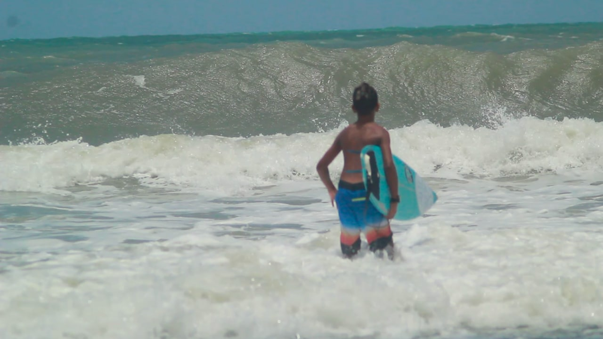
    <figcaption>Momentos antes da perda da quilha</figcaption>
</figure>

<figure>
    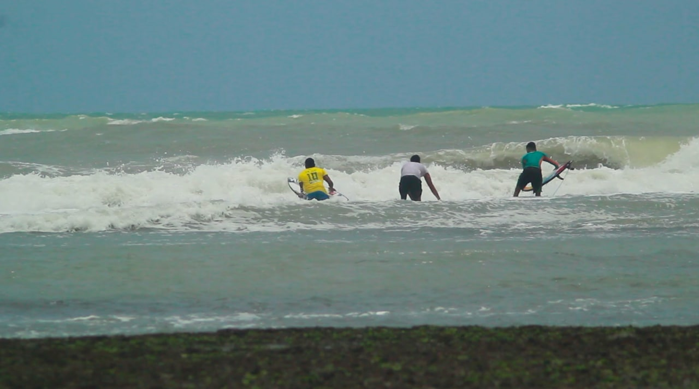
    <figcaption>Entrada na Lajinha passando pela bancada</figcaption>
</figure>

Finalmente cheguei no pico, só tinha 1 outra pessoa surfando lá e altas ondas rolando. Tinha um pouco de vento ainda, mas a onda ainda mantinha uma boa formação. Consegui pegar algumas ondas mas, não me encontrei no mar como queria. Toda a tensão de entrar, ficava pensando nas pedras e em como iria sair, já sofrendo por antecipação, o que é errado pois assim você sofre duas vezes e não aproveita nenhuma.

O Itim sempre ficava reforçando que onde pegávamos as ondas era mais fundo e não tinha com o que se preocupar mas, depois de pegar uma onda mais longa, ao final dela tentei por o pé no chão e estava relativamente raso, tudo bem que já era o final da onda mas mesmo assim fiquei um pouco mais preocupado depois disso.

Isso impactou todo meu Surf, isso já é uma dificuldade minha: RELAXAR. O Surf não é sobre força e sim: fluidez, leveza, relaxamento, para somente então, aplicar força nos momentos necessários, e quanto mais rígido e tensionado você estiver, mais travado você ficará em cima da prancha, e foi justamente o que aconteceu. Isso serve de aprendizado (não que seja algo novo pra mim), já sou rígido , tensionado e acelerado, normalmente e já venho travando essa batalha para só relaxar e surfar no flow, mas quantos mais lembretes, melhor e mais rápido virá a superação.

<figure>
    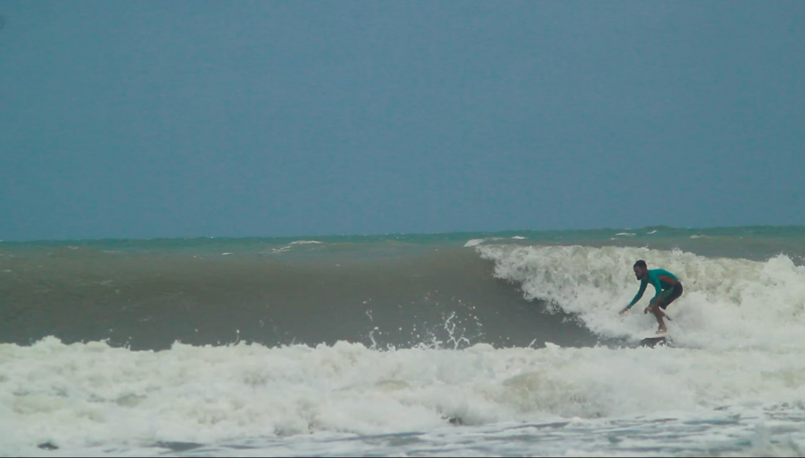
</figure>

<figure>
    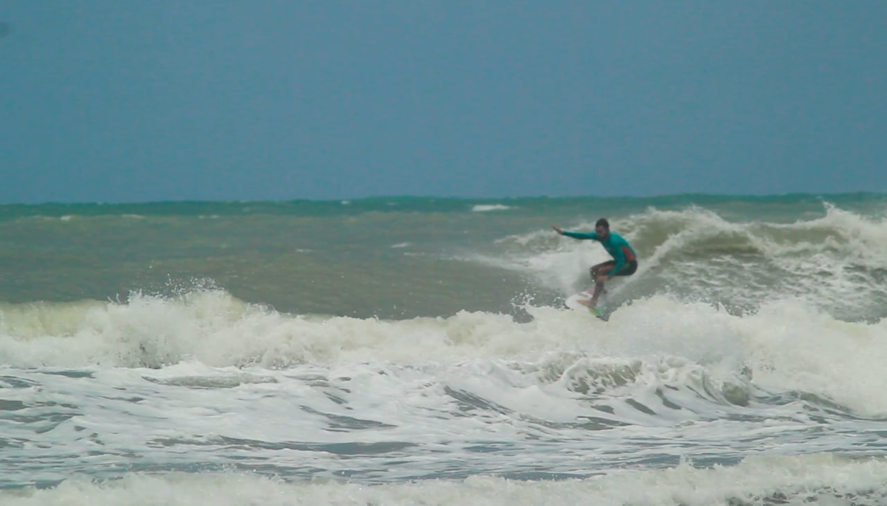
</figure>

<figure>
    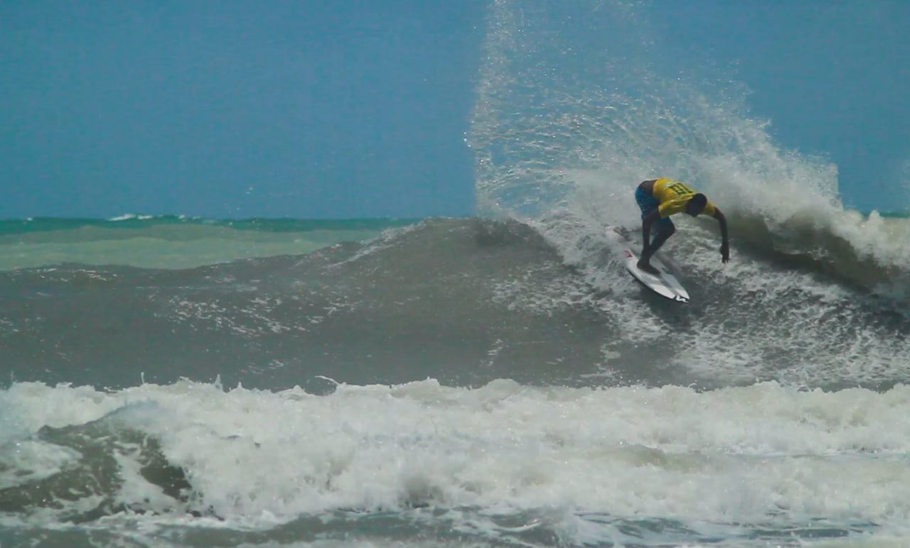
    <figcaption>Itim destruindo a onda, mais algumas várias trips e chego lá</figcaption>
</figure>

Ainda assim, foi um ótimo surf em um pico novo, saí de cabeça feita. E por falar em sair, não foi tão simples como eu imaginava. Tava com a missão na minha cabeça de ver como e por onde o Itim ia sair, mas fiquei tão focado ali nas ondas que não reparei que ele tinha saído, só percebi porque na verdade o Rafael que falou, olhei pra fora do mar e lá estava ele. Bateu aquele pequeno pensamento de: “ihhhh fudeu ó”, mas já que já tava ali mesmo decidimos ficar mais um tempim e pegar mais uma onda, mas a onda começou a ficar bem mais cavada e fechadeira, e sem perceber fomos pouco a pouco saindo do pico porque a correnteza tava puxando bastante.

Decidimos então sair logo, nesse meio tempo perguntamos aos pivetes onde era melhor de sair, segundo eles dava tudo no mesmo e não fazia muita diferença de por onde, claro que foi um conselho não muito bom, mas não tinha como esperar muito de uns meninos de 12 anos né?! Começamos a tentar sair ali perto de onde estávamos, que já era mais pra baixo do pico e onde a onda já terminava.

Mas, olhando pra frente: a bancada tava bem em cima e um pouco exposta, olhando pra onde o Itim e o Kaio estavam, ele apontou para irmos mais para a direita.

<figure>
    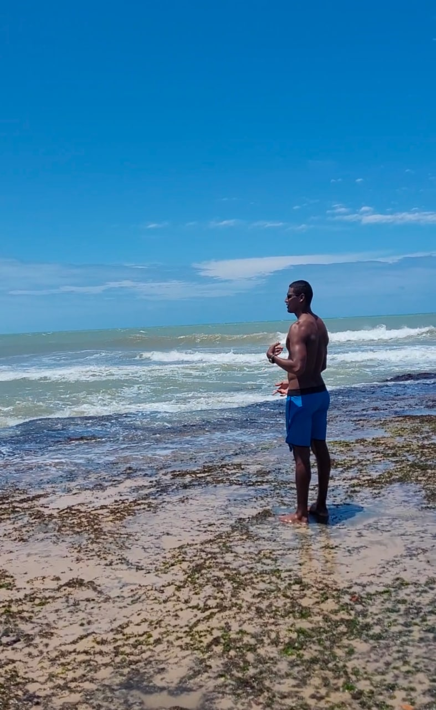
    <figcaption>É né com certeza, seguimos a orientação do Professor</figcaption>
</figure>

Seguimos remando e encontramos um pequeno canal que circundava a bancada. Nesse canal era mais tranquilo e bem mais profundo e com fundo de areia. Tentei ficar em pé para ir caminhando mas, como não tenho os 2 metros de altura do Itim não deu muito bom,  senti a correnteza me puxando e não conseguia andar em direção a saída. Voltei pra cima da prancha então, e continuei remando em direção a saída.

<figure>
    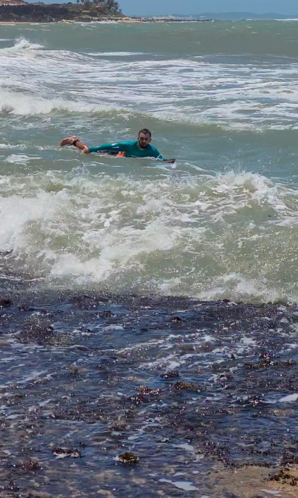
    <figcaption>Saindo pelo canal</figcaption>
</figure>

Faltava agora o último passo, subir na bancada que já era a saída, mas não foi tão simples porque, nessa parte ainda era fundo, ainda esbarrei em uma pedra tentando sair e arranhei um pouco o joelho. Mas, esperei uma ondulaçãozinha passar e consegui subir a bancada finalmente.

<figure>
    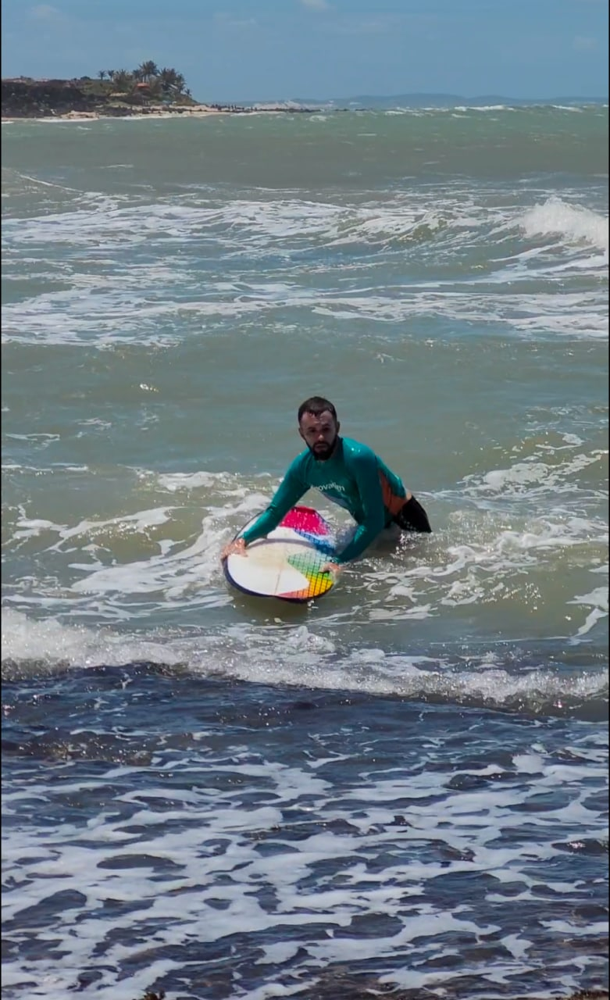
    <figcaption>Aproximando da bancada pra subir</figcaption>
</figure>

É de se esperar que estivessem preocupados pois estava um pouco complicado de sair ali, mas quem conhece as peças sabe. E é bom demais ser novatim!

<figure>
    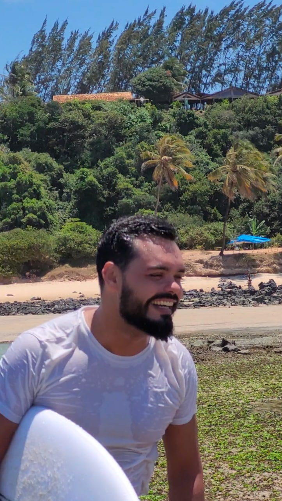
    <figcaption>Só Mangando de mim 1</figcaption>
</figure>

<figure>
    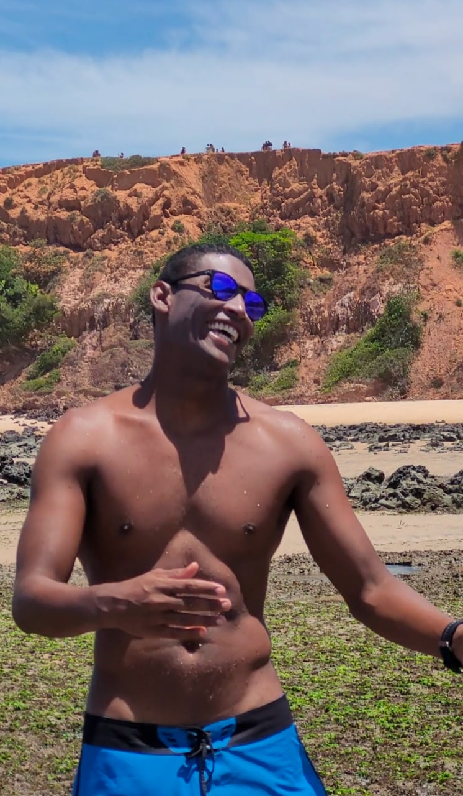
    <figcaption>Só Mangando de mim 2</figcaption>
</figure>

<figure>
    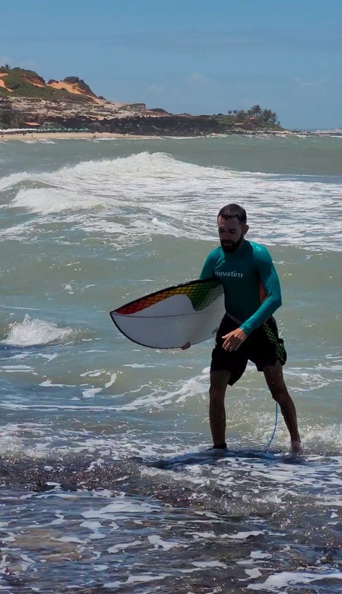
    <figcaption>Subindo na bancada finalmente</figcaption>
</figure>

<figure>
    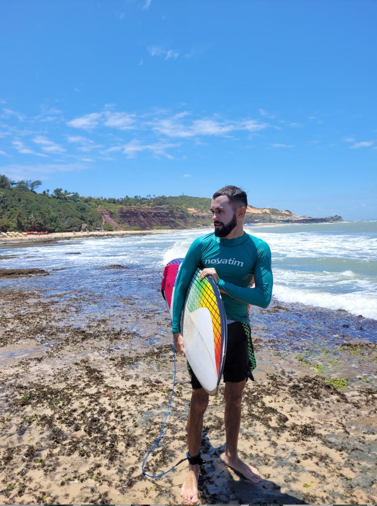
    <figcaption>De cabeça feita e em terra firme</figcaption>
</figure>

Partimos rumo a pousada então, de cabeça feita e muita resenha sobre essa caída e das dificuldades encontradas kkkk. Tivemos a sábia decisão de comer em um self service logo na saída da praia do amor, pois já era mais de meio dia e se fossemos esperar para chegar em casa, se arrumar e depois ir comer, seria tarde demais.

Chegando no Arara tivemos o merecido descanso, ainda fizemos uma caída no final de tarde na Praia do Amor, dessa vez o Kaio foi para surfar mesmo e não temos imagem dessa caída, mas não rendeu tanto para mim até porque já tava bastante cansado.

Com isso encerramos um dia de muito surf e altas histórias, amanhã é o dia do início do campeonato em Baía Formosa, então o dia promete também.

> ⟵ <a href="https://meusurf.blog/pipa-bf-1">Surf Trip: Pipa/BF #1</a>